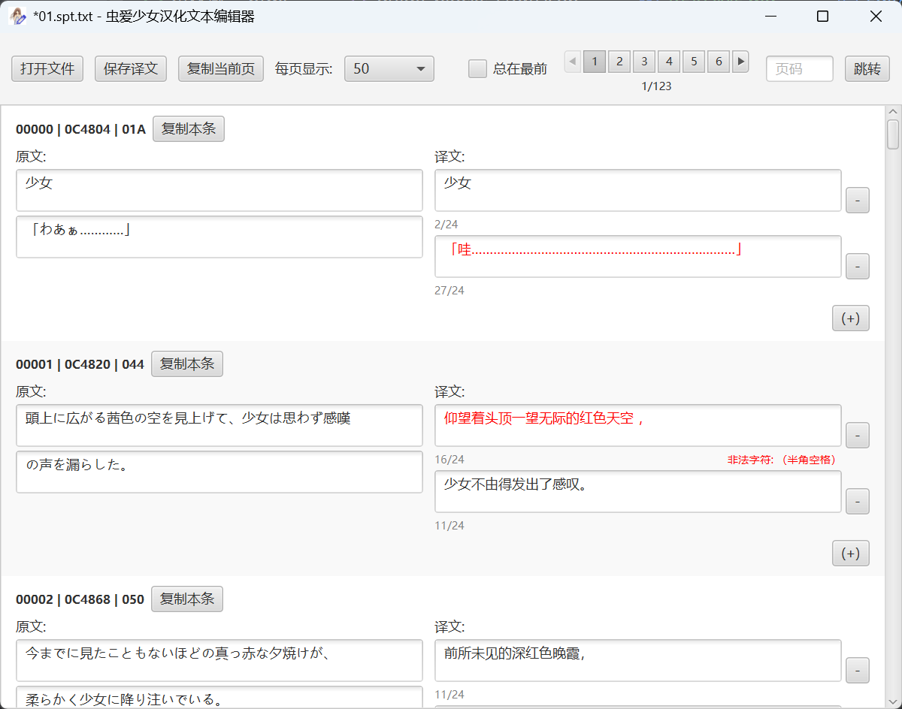

<div align="center">
  
  <h1>虫爱少女 · 汉化文本编辑器</h1>
  <p>
    <strong>一个专为 Visual Novel《EXTRAVAGANZA ～蟲愛でる少女～》汉化项目打造的专用工具</strong>
  </p>

  <p>
    
    
    
    
  </p>
</div>

---

## 📖 项目简介

本项目是一个基于 **全 Java 技术栈 (JavaFX)** 开发的文本编辑器，专用于处理从 `EXTRAVAGANZA ～蟲愛でる少女～` 解包出的脚本文件。它集成了针对 **GB2312** 字符集的严格校验功能，确保汉化后的文本能被游戏引擎正确读取而不乱码。

<div align="center">
  
  <br>
  <em>▲ 编辑器界面预览</em>
</div>
<br>

> [!IMPORTANT]
> **项目状态说明**
>
> 本项目将在 **《虫爱少女 汉化版》** 补丁发布的同时归档（Archived），不再进行后续功能的开发与维护。
>
> 如果你对汉化文本编辑器的实现感兴趣，或者希望在此基础上进行二次开发，欢迎 Fork 本仓库或通过任意方式联系作者。（虽然后期基本交给 AI 实现了细节，但设计是我设计的）

## ⚙️ 适用范围与获取

如果你的文本导出工具生成的文本格式符合以下特征，则可以直接使用本编辑器：

```text
○00008|0D0390|014○ 地獄のような日々。[\r][\n]
●00008|0D0390|014● 地獄のような日々。[\r][\n]
```

**功能特性：**
*   ✅ 完美适配上述双行对照格式
*   ✅ 内置 **GB2312** 编码严格校验，防止生僻字导致游戏乱码
*   ✅ 原生 JavaFX 界面，跨平台支持（仅 jar 包跨平台，压缩包内为环境自包含的 win10/11 工具，解压即用）

📦 **下载方式**：请直接前往 [Releases](https://github.com/Karaik/mushiai_chineseization/releases) 页面下载打包好的可执行文件。

---

## 🌸 汉化人员名单

> ✨ **在线可视化名单**：
> 本项目 Pages 已部署了可视化汉化名单，欢迎点击 [此处](https://karaik.github.io/mushiai_chineseization/) 查看完整展示。（里面有彩蛋，和发布的补丁里的彩蛋是有区别的哦）

能参与此作品的汉化实属本人的荣幸，汉化组和前汉化组的各位真的非常辛苦了！

| 职位 | 成员 |
| :--- | :--- |
| **监修** | 鳥谷真琴厨、喵喵酱 |
| **程序** | DevSeeD、这位同学 |
| **美工** | 百分百原味胖次 |
| **翻译** | 橘猫、这位同学、喵喵酱、情报弱者、バカ、小白、星洲鯨鯊。、Ayachi00、绅士君、ニャ森 |
| **校对** | 鳥谷真琴厨、喵喵酱、这位同学、ニャ森、nayuta、森凉℃、小白、夜寒、百分百原味胖次、ダレソカレ、月社キサキ |
| **润色** | なずな、小白、喵喵酱、bouquet、绅士君、Ayachi00、这位同学、朝日紫 |
| **测试** | 白薇啤酒、雪月涯、君君子兰、森凉℃、稻田养生、久岛理、weii、百分百原味胖次、なずな、这位同学、喵喵酱 |

**致谢前汉化组：**
yuugiri、兔耳茶、琉璃、2l模仿47哥、借光、溪蒼、ty清雲、长冷、查士丁尼、水产罐头、r514783、nene、未確認、夕里

---

## 📝 本人的私货

**Date:** 2026.01.04

本作品是本人参与汉化的第二部作品。

汉化工作已经基本完成，准时发布补丁也属于板上钉钉了。

因为我是个臭敲 Java 的，做本项目也算是学到了许多，写 GUI、PE 逆向，那叫一个样样不擅长，只会 CURD，但做虫爱之后也算是起步了。

这个在我还是初中生时就听说过要被汉化的作品，竟然会被转手无数道，最后被同组的大家一同画上了完美的句号。

去年听闻这作品仍在汉化当中后，也是立马便加入了。

但万万没想到这作品被汉化了数十年，进去之后竟然是一副惨状……（所以才有了此项目，后续省略一万字）

2025 一年以来的汉化工作相当于是从头开始，大家也是卯足了劲，硬生生将这块放了快二十年的硬骨头，一口一口啃了下来。

我本来以为最快也得 2027 年才能发布，但没想到大伙这么给力，直接把发布时间缩短到了一年。

说到作品本身，在我第一次接触的时候是完全没有汉化的，也是光速 C 过了序章的一条线，在完全看不懂日语的当时抛出了一句 “不就是个恶趣味的 guroge 吗” 便扬长而去。

直到后来学了点日语后，才开始认真认真推这部作品。

当时看到幼虫篇是已汉化状态，还以为这部作品已经在我不知情的情况下被汉化完毕了。结果发现只汉化了个序章，也是叹了口气。

随后便花了 50 多小时，完整推完了这部作品……那可真叫一个上瘾。

哪怕是过了好多年后的去年，对其中的非常多情节也是记忆犹新。不知道有多少人是在序章、或者是苦于找不到攻略被劝退的，这类玩家真的实属可惜。

但那都将成为过去式，这个天坑终于是填完了。（这下 G 圈剩下的未汉化巨坑就只剩最果了）

虽然不知道会不会有人看到此项目，也不知道会不会有人看汉化名单，但如果你能看到这里，也实属我们的荣幸。

**感谢汉化组的大家，也感谢能看到这段文字的你。**

---

## 🔗 相关链接

*   [针对 SystemNNN 引擎的文本导出和导入工具 (By: DevSeeD)](https://github.com/YuriSizuku/GalgameReverse/blob/343289692a434426c8c08fa0e14816544f7f52c5/project/systemnnn/src/systemnnn_spt.py)
*   [可视化汉化人员名单](https://karaik.github.io/mushiai_chineseization/)